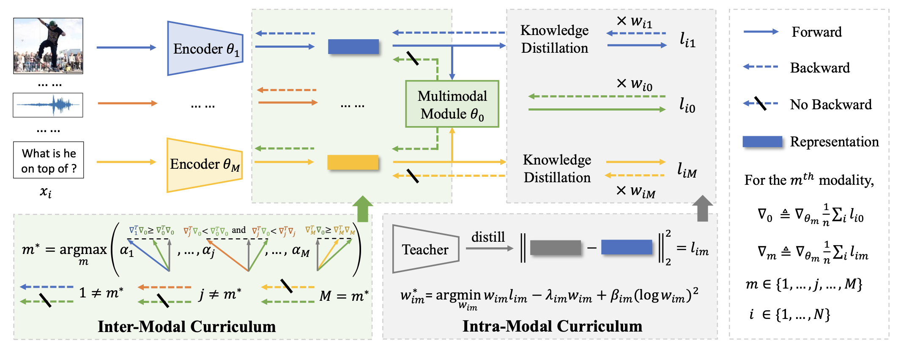

# README


## Introduction

The code of ACM MM 2023 [paper](https://dl.acm.org/doi/pdf/10.1145/3581783.3612468).

Intra- and Inter-Modal Curriculum for Multimodal Learning.



The code is developed based on [Bottom-Up-Attention](https://github.com/hengyuan-hu/bottom-up-attention-vqa).


## Requirements

1. python >= 3.7

2. pytorch >= 1.12


## Prepare Dataset

### SNLI-VE Dataset

1. Download Flickr30K into ve/data/flickr30k, and GloVe and SNLI-VE into ve/data/snli-ve.

2. Run ve/data/flickr30k/save.py to compress all images into one npy file for fast reading.

3. Run ve/data/snli-ve/create_dictionary.py to create dictionary and word embedding for LSTM input.

4. The processed dataset is shown as below.


```
    ├── data
    │   ├── flickr30k
    │   │   ├── img.npy
    │   │   ├── img2id.npy 
    │   ├── snli-ve
    │   │   ├── dictionary.pkl
    │   │   ├── glove6b_init_300d.npy
    │   │   ├── ve_dev.json
    │   │   ├── ve_test.json
    └── └── └── ve_train.json
```

### VQA-v2 Dataset

1. Download MSCOCO into ve/data/mscoco, and GloVe and VQA-v2 into ve/data/vqa-v2.

2. Run ve/data/mscoco/save.py to compress all images into one npy file for fast reading.

3. Run ve/data/vqa-v2/create_dictionary.py to create dictionary and word embedding for LSTM input.

4. Run ve/data/vqa-v2/compute_softscore.py to create the ans2label and label2ans files.

5. The processed dataset is shown as below.


```
    ├── data
    │   ├── mscoco
    │   │   ├── img.npy
    │   │   ├── img2id.npy 
    │   ├── vqa-v2
    │   │   ├── dictionary.pkl
    │   │   ├── glove6b_init_300d.npy
    │   │   ├── train_target.pkl
    │   │   ├── val_target.pkl
    │   │   ├── trainval_ans2label.pkl
    │   │   ├── trainval_label2ans.pkl
    │   │   ├── v2_OpenEnded_mscoco_train2014_questions.json
    │   │   ├── v2_OpenEnded_mscoco_val2014_questions.json
    │   │   ├── v2_OpenEnded_mscoco_test2015_questions.json
    └── └── └── v2_OpenEnded_mscoco_test-dev2015_questions.json
```

## Run the code

```
cd ve
python main.py


cd vqa
python main.py
```


## Cite

Please cite our paper as follows if you find our work useful:

```
@inproceedings{10.1145/3581783.3612468,
    author = {Yuwei Zhou, Xin Wang, Hong Chen, Xuguang Duan, and Wenwu Zhu},
    title = {Intra- and Inter-Modal Curriculum for Multimodal Learning},
    year = {2023},
    publisher = {Association for Computing Machinery},
    doi = {10.1145/3581783.3612468},
    booktitle = {Proceedings of the 31th ACM International Conference on Multimedia}
}
```